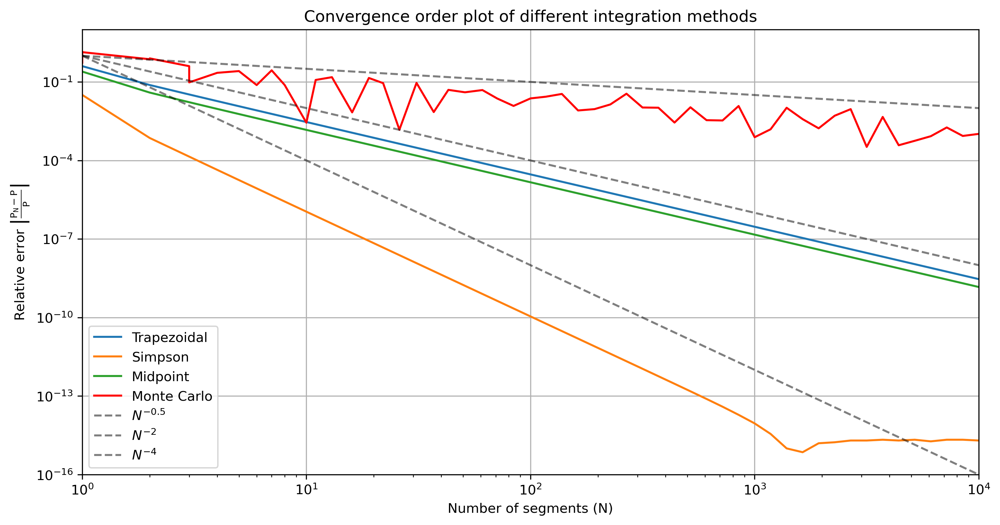
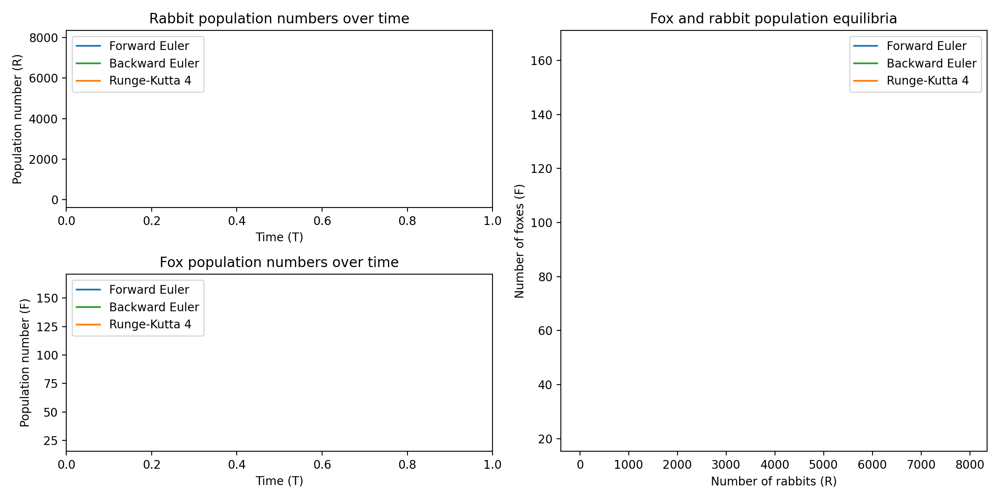

# Scientific Computing (ETHZ course)
The repository contains projects completed as part of the **Scientific Computing** course at ETH Zurich. This course offers an introduction to the basics of scientific computing and modelling with applications in biology and biomechanics.

The covered topics include floating point arithmetic, error estimation, spatial and temporal discretization techniques, numerical integration methods, stability, numerical solution of differential equations, particle simulations, parallelization and more.

**Further details about the projects can be found in their respective project directories.**

## Projects overview

### 1. &nbsp; <a href="computer_precision">`computer_precision`</a> &nbsp; Precision, machine epsilon and numerical cancellation
This project explores various concepts related to scientific computing, such as IEEE 754 floating-point numbers, machine epsilon estimation, and numerical cancellation in *Archimedes' algorithm*.

### 2. &nbsp; <a href="numerical_integration">`numerical_integration`</a> &nbsp; Numerical integration methods
This project focuses on numerical integration methods for approximating the definite integral of a given function. It explores various numerical techniques, compares their convergence behavior, and evaluates their accuracy.

***Figure 2.1:** Four numerical integration methods were implemented and tested, with the resulting plot depicting the convergence orders.*

### 3. &nbsp; <a href="lotka_volterra">`lotka_volterra`</a> &nbsp; Predator-prey model, root finding and initial value problem
This project implements a predator-prey model using the Lotka-Volterra equations. The steady-state solution is approximated numerically using the Newton-Raphson method and initial value problem (IVP) solvers (Forward Euler, Runge-Kutta 2, Heun's method, Runge-Kutta 4 and Backward Euler) are used to solve the model. Results are visualized through plots, highlighting the convergence of the root-finding algorithm and the stability of the different numerical techniques.

***Figure 3.2:** Multiple initial value problem (IVP) solvers were implemented and tested using a Lotka-Volterra system with rabbits and foxes. The plot highlights the differences in numerical stability between the implemented methods.*

### 4. &nbsp; <a href="mass_spring">`mass_spring`</a> &nbsp; Mass-spring physics model
This project involves the implementation of a mass-spring physics simulation model. The simulation aims to replicate the behavior of a rubber block dropping on the ground, bouncing under the influence of gravity, and potentially interacting with walls. The simulation utilizes *Hooke's law* to model the behavior of springs. Time integration is achieved using the semi-implicit Euler method.

***Figure 4.1:** Mass-spring simulation output and energy diagram for a rubber block bouncing without damping.*

### 5. &nbsp; <a href="molecular_dynamics">`molecular_dynamics`</a> &nbsp; Molecular dynamics simulation
This project implements a molecular dynamics (MD) simulation, modelling a gas composed of point-like particles in three-dimensional space. The particles interact with each other through the Lennard-Jones potential, which describes the forces between them based on their distances. This simulation employs periodic boundary conditions (PBCs) to emulate an infinite system and the semi-implicit Euler integration method to conserve the energy of the particles.

***Figure 5.1:** Molecular dynamics simulation of a gas with 100 inert particles and periodic boundary conditions.*

### 6. &nbsp; <a href="errors">`errors`</a> &nbsp; Error estimation and parameter sensitivity
Using samples drawn from a lognormal distribution, this project illustrates how standard errors can be estimated using bootstrapping and how the standard errors are dependent on the sample size. It also returns to the Lotka-Volterra predator-prey model to determine the relative condition number for small variations in the input parameters to showcase how especially sensitive parameters can be found and considered in the design of experiments or simulations.

***Figure 6.1:** Histogram of samples drawn from a lognormal distribution (left) and dependency of the standard error on the sample size (right).*

### 7. &nbsp; <a href="vertex_model">`vertex_model`</a> &nbsp; Vertex model for tissue growth
This project implements a vertex model for cellular growth.

### 8. &nbsp; `finite_difference` &nbsp; Finite difference method
TEXT

## Dependencies, installation and usage
Each of the directories in this repository contains a `README.md` file, detailing any dependencies, how to run the files, their usage and additional information about the projects.

## Project results

## Contributing
If you want to contribute to this project, found any bugs or have new feature ideas, please open an issue!

## License
This project is licensed under the **GNU General Public License v3.0**, allowing you to freely use, modify, and distribute the code. Any derived works must also be licensed under GPL-3.0, promoting open-source collaboration and transparency. Please review the license terms before using or contributing to this project.
