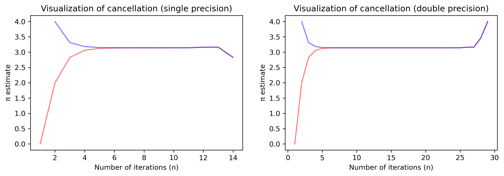

# 1. &nbsp; Precision, machine epsilon and numerical cancellation
This project explores various concepts related to scientific computing, such as IEEE 754 floating-point numbers, machine epsilon estimation, and numerical cancellation in *Archimedes' algorithm*.

## File description
#### <a href="precision_epsilon_cancellation.ipynb">`precision_epsilon_cancellation.ipynb`</a>
The project is realized using a Jupyter notebook, which also goes into more detail about the inner workings of the programs.

## Dependencies
This project requires the following Python libraries:
`time`
`warnings`
`numpy`
`pandas`
`matplotlib`

Some of the libraries are already included with every installation of Python, some are not. They can be installed using PIP:
```
pip install numpy pandas matplotlib
```

## Installation
Re-running the code in this notebook requires an installation of Python 3 and the libraries mentioned above. No external files are needed.

## Usage
The notebooks are annotated and self-explanatory.

## Graphical output


***Figure 1.1:** Visualization of numerical cancellation when approximating &pi; using single and double precision.*

## Contributing
If you want to contribute to this project, found any bugs or have new feature ideas, please open an issue!

## License
This project is licensed under the **GNU General Public License v3.0**, allowing you to freely use, modify, and distribute the code. Any derived works must also be licensed under GPL-3.0, promoting open-source collaboration and transparency. Please review the license terms before using or contributing to this project.
