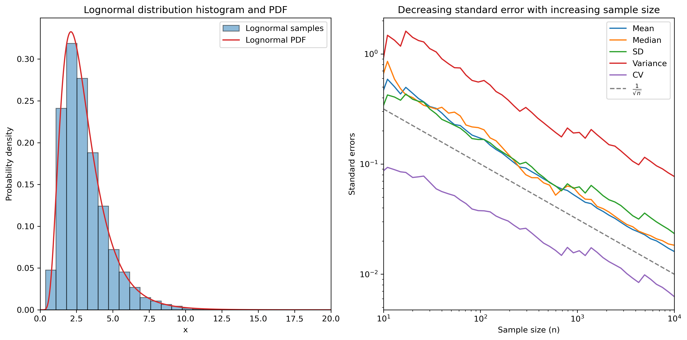

# 6. &nbsp; Error estimation and parameter sensitivity
Using samples drawn from a lognormal distribution, this project illustrates how standard errors can be estimated using bootstrapping and how the standard errors are dependent on the sample size. It also returns to the Lotka-Volterra predator-prey model to determine the relative condition number for small variations in the input parameters to showcase how especially sensitive parameters can be found and considered in the design of experiments or simulations.

## File descriptions
#### <a href="error_estimation.ipynb">`error_estimation.ipynb`</a>
This notebook showcases how to estimate errors of statistics derived from a lognormal distribution and how these errors change with different sample sizes using bootstrapping. It also visually confirms the theoretical relationship between sample size and standard error.

#### <a href="parameter_sensitivity.ipynb">`parameter_sensitivity.ipynb`</a>
This notebook demonstrates how small changes in model parameters affect the behavior of the Lotka-Volterra predator-prey model, with a focus on identifying the most sensitive parameter through relative condition numbers.

## Dependencies
This project requires the following Python libraries:
`numpy`
`matplotlib`
`scipy`

They can be installed using PIP:
```
pip install numpy matplotlib scipy
```

## Installation
Re-running the code in this notebook requires an installation of Python 3 and the libraries mentioned above. No external files are needed.

## Usage
The notebooks are annotated and self-explanatory. The following parameters of the `error_estimation.ipynb` notebook can be modified:

- `mu`: Expectation value of the distribution.
- `sigma`: Standard deviation of the distribution.
- `n`: Sample size.
- `x`: Samples drawn from a probability distribution (lognormal distribution by default).
- `B`: Number of bootstrap samples (higher = more precise).

In the `parameter_sensitivity.ipynb` notebook, the following model parameters can be modified:

- `alpha`: Reproduction rate of rabbits.
- `beta`: Rate at which foxes kill rabbits.
- `gamma`: Fox mortality rate.
- `delta`: Reproduction rate of foxes relative to rabbit abundance.
- `k`: Relative variation in the parameters above.

The starting values of the populations and the simulation parameters can also be modified:

- `x`: Initial populations of rabbits and foxes.
- `T`: Total simulation time.
- `h`: Step size of the simulation.


## Graphical output


***Figure 6.1:** Histogram of samples drawn from a lognormal distribution (left) and dependency of the standard error on the sample size.*

## Contributing
If you want to contribute to this project, found any bugs or have new feature ideas, please open an issue!

## License
This project is licensed under the **GNU General Public License v3.0**, allowing you to freely use, modify, and distribute the code. Any derived works must also be licensed under GPL-3.0, promoting open-source collaboration and transparency. Please review the license terms before using or contributing to this project.
