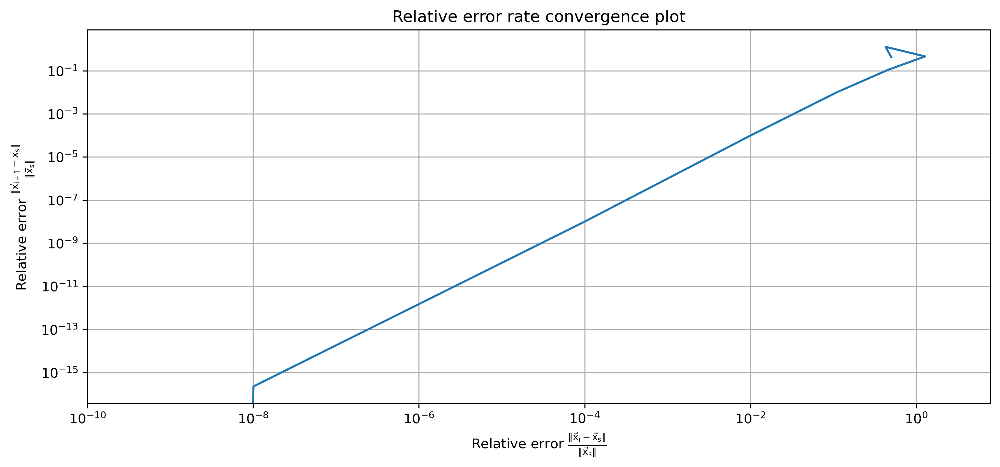

# 3. &nbsp; Predator-prey model, root finding and initial value problem
This project implements a predator-prey model using the Lotka-Volterra equations. The steady-state solution is approximated numerically using the Newton-Raphson method and numerical techniques (Forward Euler, Backward Euler, and Runge-Kutta 4) are used to solve the model. Results are visualized through plots, highlighting the convergence of the root-finding algorithm and the stability of the different numerical techniques.

## File descriptions
#### <a href="predator_prey_root.ipynb">`predator_prey_root.ipynb`</a>
This program explores a predator-prey model using the Lotka-Volterra equations and employs the Newton-Raphson method to find the steady-state solutions for the populations of rabbits and foxes. It also creates a convergence plot to visualize the decrease in relative error during the iterative process.

#### <a href="predator_prey_ivp.ipynb">`predator_prey_ivp.ipynb`</a>
This program focuses on numerically solving the Lotka-Volterra predator-prey model over a specific time interval using five methods: Forward Euler, Runge-Kutta 2, Heun's method, Runge-Kutta 4 and Backward Euler. The results are visualized in plots, showcasing the behaviors of selected methods and their numerical stability.

#### <a href="predator_prey_animation.py">`predator_prey_animation.py`</a>
This Python script can be used to animate the plot produced by the IVP solver program. The selected methods that are plotted can be swapped for others and the animation can be saved or just displayed by uncommenting the respective lines at the end of the script using the `#` sign.

## Dependencies
This project requires the following Python libraries:
`numpy`
`matplotlib`

They can be installed using PIP:
```
pip install numpy matplotlib
```

## Installation
Re-running the code in this notebook requires an installation of Python 3 and the libraries mentioned above. No external files are needed.

## Usage
The notebooks are annotated and self-explanatory. The model has the following parameters that can be modified:

- `alpha`: Reproduction rate of rabbits.
- `beta`: Rate at which foxes kill rabbits.
- `gamma`: Fox mortality rate.
- `delta`: Reproduction rate of foxes relative to rabbit abundance.

The starting values of the populations can also be modified:

- `x`: Initial populations of rabbits and foxes.
- `tolx`: Error tolerance for the Newton-Raphson method.

In the `predator_prey_ivp.ipynb` notebook, the following additional parameters can be modified:

- `T`: Total simulation time.
- `h`: Step size of the simulation.

There, only the solutions for three of the IVP solvers are plotted, but the solutions that are plotted can be adjusted by (un)commenting the desired lines by adding or removing the `#` sign in front of the given lines of the subplots.

## Graphical output


***Figure 3.1:** Convergence plot of the Newton-Raphson method from the root finding program.*


***Figure 3.2:** Plot with three subplots, highlighting the difference between multiple initial value problem (IVP) solvers using a Lotka-Volterra system with rabbits and foxes.*

## Contributing
If you want to contribute to this project, found any bugs or have new feature ideas, please open an issue!

## License
This project is licensed under the **GNU General Public License v3.0**, allowing you to freely use, modify, and distribute the code. Any derived works must also be licensed under GPL-3.0, promoting open-source collaboration and transparency. Please review the license terms before using or contributing to this project.
