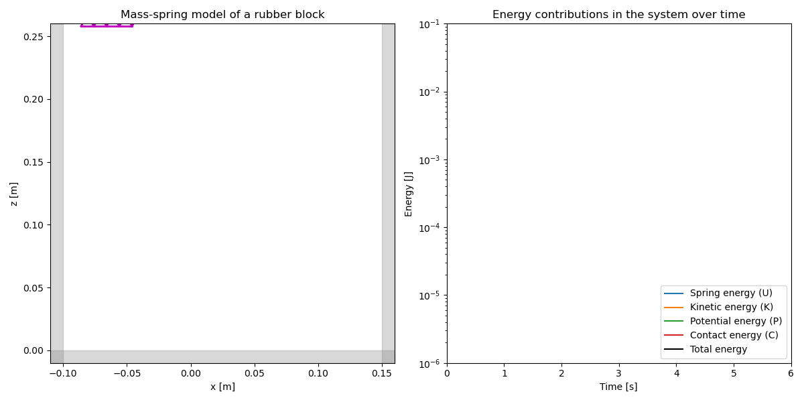
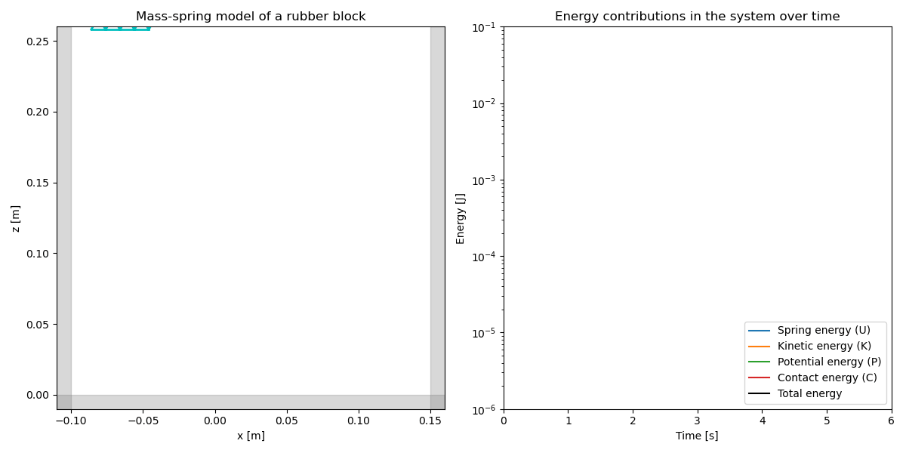

# 4. &nbsp; Mass-spring physics model
This project involves the implementation of a mass-spring physics simulation model. The simulation aims to replicate the behavior of a rubber block dropping on the ground, bouncing under the influence of gravity, and potentially interacting with walls. The simulation utilizes *Hooke's law* to model the behavior of springs. Time integration is achieved using the semi-implicit Euler method.

## File description
#### <a href="mass_spring_model.ipynb">`mass_spring_model.ipynb`</a>
The Jupyter notebook explains the simulated system, is used to set the simulation parameters and integrates two classes: `Point` and `Spring`. These are used to set all parameters of the objects and calculate positions, velocities, forces, energies and time steps. The mass points are connected to the springs and a plot including an energy diagram is initialized. The function `run_simulation` iteratively calculates the forces and updates positions and velocities. The animation is updated in each frame, and energy values are recorded for plotting. The simulation animation is created using the `FuncAnimation` class of `matplotlib`. The animation shows the behavior of the rubber block over time, including bouncing, rotating, and interacting with walls. Energy contributions (spring energy, kinetic energy, potential energy, and contact energy) are plotted on a logarithmic scale over time. The simulation results showcase how the rubber block behaves under different conditions, with and without damping. The energy diagram highlights how different energy components evolve during the simulation, providing insights into the system's behavior and dynamics.

## Dependencies
This project requires the following Python libraries:
`numpy`
`matplotlib`

They can be installed using PIP:
```
pip install numpy matplotlib
```

## Installation
Re-running the code in this notebook requires an installation of Python 3 and the libraries mentioned above. No external files are needed.

## Usage
The notebooks are annotated and self-explanatory. The model has the following parameters that can be modified:

Physical parameters:
- `m`: Point mass [kg]
- `k`: Spring stiffness [kg/s<sup>2</sup>]
- `L`: Rest length of springs [m]
- `g`: Gravity acceleration [m/s<sup>2</sup>]
- `gamma`: Viscous damping coefficient [kg/s]

Walls and ground:
- `ground_flag`: Set to True to enable the ground as a wall
- `ceil_flag`: Set to True to enable the ceiling as a wall
- `left_flag`: Set to True to enable the left wall
- `right_flag`: Set to True to enable the right wall
- `ground`: Z position of the ground (floor) [m]
- `ceiling`: Z position of the ceiling [m]
- `left_wall`: X position of the left wall [m]
- `right_wall`: X position of the right wall [m]

Simulation parameters:
- `t_end`: End time of simulation [s]
- `h`: Time step for simulation [s]
- `n`: Number of mass points in each direction

Initialization:
- `x0`: Initial position of the lower-left corner of the block [m]
- `v0`: Initial velocity of the block [m/s]

Output parameters:
- `duration`: Duration of the simulation animation [s]
- `FPS`: Frames per second for the animation
- `frames`: Total number of frames in the animation
- `steps_per_frame`: Time steps per animation frame

In the end, an animation is saved as a `.GIF` file. Please refer the the `matplotlib` documentation for further output options.

## Graphical output


***Figure 4.1:** Simulation output and energy diagram for a rubber block bouncing without damping (&gamma; = 0).*



***Figure 4.2:** Simulation output and energy diagram for a rubber block bouncing with damping (&gamma; = 0.001).*

## Contributing
If you want to contribute to this project, found any bugs or have new feature ideas, please open an issue!

## License
This project is licensed under the **GNU General Public License v3.0**, allowing you to freely use, modify, and distribute the code. Any derived works must also be licensed under GPL-3.0, promoting open-source collaboration and transparency. Please review the license terms before using or contributing to this project.
