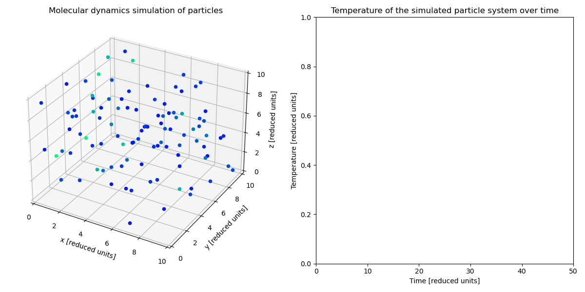

# 5. &nbsp; Molecular dynamics simulation
This project implements a molecular dynamics (MD) simulation, modelling a gas composed of point-like particles in three-dimensional space. The particles interact with each other through the Lennard-Jones potential, which describes the forces between them based on their distances. This simulation employs periodic boundary conditions (PBCs) to emulate an infinite system and the semi-implicit Euler integration method to conserve the energy of the particles.

## File descriptions
#### <a href="molecular_dynamics_simulation.ipynb">`molecular_dynamics_simulation.ipynb`</a>
The simulation uses reduced units and default parameters for the particle mass, energy, number of particles, and volume. The particles are randomly placed in the simulation box with a minimum initial distance to avoid overlap. Particle motion is governed by the Lennard-Jones potential and a semi-implicit Euler method is employed to update particle positions and velocities, ensuring energy conservation. The temperature of the system is calculated using the kinetic energy of particles. It provides insights into the energy distribution within the system. To optimize computation for a large number of particles, linked cell lists are used. This approach reduces the computational complexity and accelerates interaction calculations. The program offers a 3D visualization of particle motion within the simulation box. Each particle's color reflects its velocity magnitude, aiding the visualization of particle behavior. The simulation is animated over time, showcasing particle interactions and movements.

#### <a href="molecular_dynamics_naive.ipynb">`molecular_dynamics_naive.ipynb`</a>
This notebook features a more naive approach for calculating the forces between particles, which could potentially be faster for very small particle numbers and is less complex than the main program.

## Dependencies
This project requires the following Python libraries:
`numpy`
`matplotlib`
`tqdm`

They can be installed using PIP:
```
pip install numpy matplotlib tqdm
```

## Installation
Re-running the code in this notebook requires an installation of Python 3 and the libraries mentioned above. No external files are needed.

## Usage
The notebooks are annotated and self-explanatory. The model has the following parameters that can be modified:

Physical Parameters:
- `N`: Number of simulated particles
- `L`: Vector storing the length of the box in 3D [reduced units]
- `r_min`: Minimum distance between particles at initialization [reduced units]
- `r_cut`: Cut-off for interactions [reduced units]

Simulation Parameters:
- `t_end`: End time of simulation [reduced units]
- `h`: Time step for simulation [reduced units]

Output parametes:
- `duration`: Duration of the simulation animation [s]
- `FPS`: Frames per second for the animation
- `frames`: Total number of frames in the animation
- `steps_per_frame`: Time steps per animation frame

In the end, an animation is saved as a `.GIF` file. Please refer the the `matplotlib` documentation for further output options.

## Graphical output


***Figure 5.1:** Molecular dynamics simulation of a gas with 100 inert particles and a box size of 10 in reduced units.*


***Figure 5.2:** Molecular dynamics simulation of a gas with 200 inert particles and a box size of 10 in reduced units.*

**More simulation runs with further parameter variations can be found in the `output` folder.**

## Contributing
If you want to contribute to this project, found any bugs or have new feature ideas, please open an issue!

## License
This project is licensed under the **GNU General Public License v3.0**, allowing you to freely use, modify, and distribute the code. Any derived works must also be licensed under GPL-3.0, promoting open-source collaboration and transparency. Please review the license terms before using or contributing to this project.
